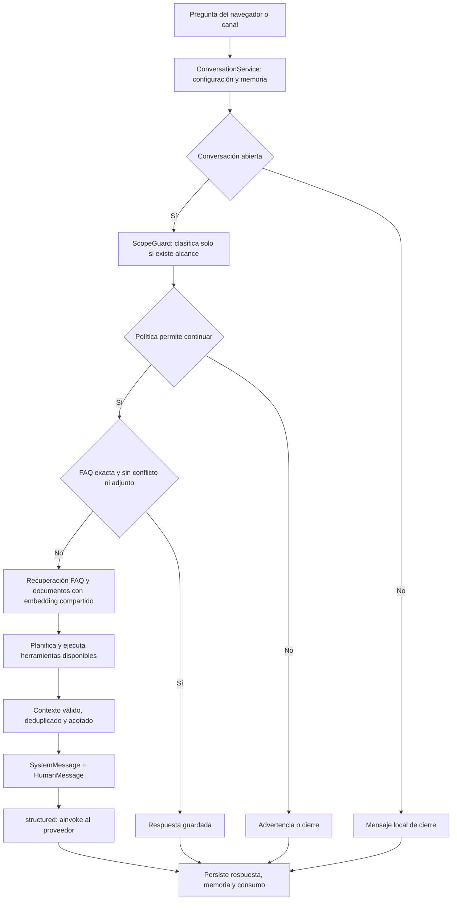

# Revisión de conexión, prompts, RAG y consumo

Revisión del código local del 14–15 de septiembre de 2026. Los cambios eliminan
duplicaciones de texto y embeddings, acotan el contexto y permiten auditar las
llamadas al modelo. Se verificaron con proveedores vectoriales locales y
transporte de modelos simulado. No se consultaron claves ni cuentas reales.

## Archivos comentados y recorrido

Los comentarios en español explican cada instrucción lógica de los módulos
centrales; una instrucción que ocupa varias líneas se explica como unidad.
También se comentaron las entradas HTTP y el envío desde el navegador. No se
añadieron comentarios indiscriminadamente a scripts de despliegue, migraciones
o pantallas ajenas a este flujo. Los comentarios Python/JavaScript no se incluyen
en las solicitudes al modelo y no aumentan los tokens de la aplicación.

| Archivo | Función |
| --- | --- |
| `backend/app/providers/llm.py` | Construye clientes OpenAI/Gemini; propaga timeout, reintentos, salida y razonamiento; consulta catálogos. |
| `backend/app/providers/embeddings.py` | Construye clientes que convierten preguntas y documentos en vectores. |
| `backend/app/providers/cached_embeddings.py` | Reutiliza una consulta, incluso en curso, dentro de la misma petición. |
| `backend/app/providers/__init__.py` | Expone proveedores mediante importación diferida. |
| `backend/app/services/connections.py` | Administra conexiones SQL e integraciones de canales. |
| `backend/app/services/agents.py` | Guarda configuración y versiones del prompt; solicita reindexación si cambia el perfil. |
| `backend/app/services/runtime_hooks.py` | Ensambla mensajes y hace las llamadas efectivas al modelo. |
| `backend/app/runtime/graph.py` | Decide qué etapas ejecutar, omitir o terminar. |
| `backend/app/runtime/state.py` | Define el estado compartido y el contrato de operaciones del grafo. |
| `backend/app/runtime/prompt_budget.py` | Deduplica evidencia y limita JSON e historial sin cortar estructuras. |
| `backend/app/services/conversations.py` | Recupera memoria, ejecuta el grafo y persiste respuesta, contador y consumo. |
| `backend/app/providers/loaders.py` | Extrae texto de PDF, DOCX, TXT y MD; normaliza y divide fragmentos. |
| `backend/app/services/knowledge.py` | Registra conocimiento, encola indexación y filtra fuentes consultables. |
| `backend/app/providers/vectors.py` | Escribe, recupera y elimina vectores en Chroma o FAISS. |
| `backend/app/worker.py` | Procesa indexación y entregas pendientes; reutiliza respuestas ya generadas. |

## Conexión y envío del prompt

El navegador envía únicamente `message` y `conversation_id` a
`/public/agents/{id}/chat`; Playground usa `/api/agents/{id}/chat`. Las claves,
el historial completo y las instrucciones del administrador permanecen en el
backend. La ruta pública valida visitante, publicación y cuota antes del chat.

`ApplicationRuntimeHooks.model()` obtiene la credencial mediante
`CredentialService` y construye una vez el cliente del proveedor seleccionado.
Construirlo no genera una respuesta. El envío ocurre en
`structured()` al ejecutar `with_structured_output(...).ainvoke(messages)`.
Se conservan la respuesta cruda y sus métricas, además del objeto validado.

La generación final tiene dos mensajes:

- **SystemMessage:** prompt vigente del administrador, reglas de uso de
  evidencia, enlaces autorizados y advertencia sobre resultados parciales.
- **HumanMessage:** un JSON compacto con `history`, `question` y `evidence`.
  La evidencia es un objeto JSON, no una segunda cadena JSON escapada. La
  pregunta actual aparece una sola vez; la memoria contiene mensajes anteriores.

Las versiones antiguas del prompt se guardan para revisión/restauración: no se
envían todas al modelo. Guardar/restaurar mediante los endpoints de prompts crea
versiones; un PATCH genérico que cambie `system_prompt` actualmente no crea una
versión adicional. La UI de prompts utiliza los endpoints de versionado.

## Cómo funciona el RAG

1. La carga guarda el archivo y encola un trabajo. No se envía el archivo entero
   al modelo de conversación en cada pregunta.
2. El worker extrae texto y lo divide con `RecursiveCharacterTextSplitter`.
   `chunk_size=1000` y `chunk_overlap=150` son caracteres, no tokens.
3. Se calculan embeddings y se guardan fragmentos con IDs estables y metadatos.
   Cada colección separa agente, FAQ/documentos y perfil proveedor/modelo.
4. Una consulta selecciona primero las fuentes activas, indexadas y del perfil
   actual en SQL. El proveedor vectorial aplica esos IDs antes de elegir top-k.
5. FAQ y documentos reutilizan el embedding de la misma pregunta. `retriever_k=4`
   significa hasta cuatro FAQ y hasta cuatro fragmentos documentales, no cuatro
   resultados combinados. MMR evalúa más candidatos para diversificar, pero no
   necesita otra llamada de embeddings por candidato.
6. Solo los resultados recuperados entran al contexto; se elimina contenido
   repetido y se conservan identificadores, fuente, página e información de adjuntos.

Cambiar el modelo de embeddings exige otro espacio vectorial y nueva indexación.
Reindexar el mismo perfil conserva vectores idénticos y elimina IDs sobrantes.
Una indexación parcial guarda los IDs previstos para que su eliminación pueda
limpiar todos los fragmentos que llegaron a escribirse.

## Problemas corregidos y efecto

| Antes | Ahora | Efecto verificable |
| --- | --- | --- |
| Pregunta actual en historial y en `question`. | Se elimina del historial antes de aplicar su ventana. | Una copia de la pregunta por generación. |
| `content`, `page_content` y a veces `metadata.answer` repetían texto. | Un campo de texto por fragmento; duplicados de una misma fuente se omiten. | Menos caracteres de entrada. |
| Contexto serializado dos veces y cortado a mitad de JSON. | Evidencia como objeto, JSON válido y recortes explícitos. | Conserva estructura bajo presupuesto. |
| Historial limitado solo por cantidad de mensajes. | También se limita su tamaño serializado. | Un mensaje largo no hace crecer el prompt sin ese límite. |
| Herramientas habilitadas sin archivos/conexiones generaban planificación. | Inventario vacío termina localmente. | Cero llamadas de planificación en ese caso. |
| Fuentes pendientes/inactivas podían ocupar el top-k antes del filtrado. | Filtrado de fuentes antes de similitud/MMR. | Recupera candidatos válidos que antes podían quedar excluidos. |
| Reindexación idéntica recalculaba embeddings. | Se comparan IDs y contenido persistido. | Cero nuevos embeddings de documentos sin cambios, según condiciones del proveedor. |
| Guardar una FAQ idéntica volvía a ponerla pendiente. | Si está INDEXED/INACTIVE en el perfil actual, no se encola de nuevo. | Evita trabajo y ausencia temporal innecesarios. |
| OpenAI embeddings tenía dos reintentos internos además del worker. | Cero reintentos internos. | El SDK no multiplica cada intento del worker por tres. |
| Reintentos Gemini no distinguían reintentos e intentos totales. | Configuración N se convierte a N+1 intentos. | Respeta las opciones de uno/dos reintentos. |
| Gemini embeddings no tenía timeout efectivo definido por la aplicación. | Configuración real de petición con 45 s y un intento. | Límite aplicado en consultas/documentos sync/async. |
| Consumo agregado poco visible ante errores. | Entrada, salida, total y disponibilidad de métricas por etapa. | El fallo de parseo conserva consumo; timeout desconocido no se presenta como gratuito. |

La caché de embeddings comparte operaciones sync/async en curso, devuelve copias
de vectores y conserva un error durante esa petición para no repetir la misma
operación al consultar otra colección. Consultas distintas pueden avanzar en
paralelo. No se comparte memoria entre usuarios ni se cachean respuestas del chat.

## Cuántas llamadas pueden hacerse

Con cero reintentos del LLM, el flujo permite:

| Caso | Llamadas LLM |
| --- | ---: |
| Conversación cerrada o límite alcanzado | 0 |
| FAQ exacta, sin alcance configurado | 0 |
| FAQ exacta, con clasificación de alcance | 1 |
| Respuesta generada, sin alcance ni herramientas disponibles | 1 |
| Respuesta generada con alcance o planificación de herramientas | 2 |
| Clasificación + planificación + generación | 3 |

Una pregunta que necesita ambas búsquedas FAQ/documentos usa un embedding de
consulta por perfil dentro de la petición. Si no hay fuentes consultables, no
se vectoriza la pregunta. Los embeddings de indexación se consumen al procesar
contenido nuevo/modificado, y son una categoría distinta de las llamadas LLM.

El worker guarda la respuesta antes de entregarla al canal: reintentar la entrega
reutiliza ese resultado y no vuelve a generar una respuesta ni aumenta el contador.

## Controles disponibles

En **Agentes → Modelo → Velocidad y límites de respuesta**:

- `llm_max_retries`: inicial 0. Aumentarlo puede repetir solicitudes.
- `llm_timeout_seconds`: inicial 45 s por llamada; el turno completo tiene 150 s.
- `llm_max_output_tokens`: sigue siendo opcional. Si está en 0 en la UI, se usa
  el predeterminado del modelo; **no hay un límite propio de salida**. Se conserva
  esta opción porque un límite bajo puede impedir terminar modelos de razonamiento.
- `max_context_chars`: inicial 32 000 para FAQ, documentos y herramientas juntos.
- `max_tool_context_chars`: inicial 16 000 para el inventario. Si se supera,
  la planificación falla antes de enviar ese inventario; reduce recursos o ajusta
  el límite. Su evidencia FAQ tiene su propio presupuesto de igual tamaño.

En **Agentes → Memoria**, `max_history_chars` limita a 16 000 caracteres por
defecto, además de `memory_window=20`. Se conservan mensajes recientes completos;
el historial persistido no se borra. Cuando todo el contexto cabe, no se recorta.
Si es necesario recortar evidencia, se alternan fuentes y se marca `truncated`;
las filas SQL se omiten completas y sus contadores reflejan el subconjunto enviado.

Los límites de caracteres controlan volumen, pero no equivalen a un presupuesto
exacto de tokens. Tampoco abarcan el prompt de sistema, la pregunta actual,
enlaces, esquema de respuesta ni todas las etapas combinadas. Esos campos tienen
sus validaciones propias. No existe aquí un presupuesto monetario global por turno.

**Playground → Ejecución del agente** muestra llamadas, tokens reportados de
entrada/salida y total, además de tokens por nodo. La API devuelve `usage` y la
auditoría conserva `llm_usage` en la traza de cada pregunta. Si falta respuesta de
consumo, `usage_complete=false`. Un timeout global conserva las etapas conocidas
con duración desconocida donde no quedó una traza completa.

## Verificación y límites de la conclusión

Las pruebas incluyen índices reales Chroma y FAISS locales con embeddings
deterministas; extracción PDF/DOCX/TXT; aislamiento de agentes/perfiles;
similitud/MMR; borrado; reindexación parcial; caché concurrente; configuración
efectiva de SDK; payload final; políticas de alcance; contabilidad en fallos y
reutilización de respuestas en reintentos. Las suites están en `tests/` y los
flujos del panel en `admin/test_ui.py`.

Validación ejecutada: 184 casos aprobados en la pasada completa y una prueba de
timeout ajustada para sincronizar por evento, seguida de 25 casos enfocados
aprobados (incluyen ese timeout y los presupuestos). También aprobaron los 23
flujos de `admin.test_ui`, las 7 comprobaciones JavaScript de enlaces y Ruff.
El entorno `.venv` conserva una ruta de otro equipo: se usó Python 3.12.14
disponible en Codex con sus paquetes locales de `.venv`, sin recrear el entorno
ni modificar credenciales. Los temporales de pytest necesitaron ejecución fuera
del sandbox por las ACL de Windows.

`scripts/audit_prompt_size.py` reproduce un caso sintético con aliases y un
fragmento repetido. El payload de datos baja de **7508 a 1886 caracteres**
(5622 menos; **74,88 %**). Esto mide solo ese ejemplo y excluye el mensaje de
sistema y los esquemas: no es un porcentaje de ahorro de tokens ni de factura.

Límites que siguen vigentes:

- `Question.tokens` y `usage` contabilizan el uso LLM reportado, no embeddings,
  solicitudes sin métricas ni todos los posibles intentos internos de un SDK.
  La factura real debe contrastarse con la cuenta del proveedor.
- Chroma evita recalcular cuando texto **y metadatos** son idénticos; un cambio
  solo de metadatos todavía usa la ruta de embedding de LangChain. FAISS reutiliza
  también el vector cuando solo cambia metadata.
- FAISS reconstruye y lee su índice completo por consulta; es adecuado para el
  modo local de un proceso previsto por este proyecto. Eso consume CPU/disco,
  no embeddings adicionales de los documentos almacenados.
- No hay umbral de relevancia ni evaluación semántica con preguntas reales.
  top-k puede incluir textos poco pertinentes y las preguntas de seguimiento
  usan su texto actual en la recuperación. Las pruebas verifican mecánica y
  aislamiento; no prueban precisión semántica de cada respuesta real.
- PDF escaneado necesita OCR previo. No se inventa texto para documentos vacíos.
- La subclase de embeddings Gemini aplica límites mediante `_build_config` del
  adaptador instalado; hay pruebas del payload real y deben repetirse al actualizar
  `langchain-google-genai`. Se verificó con 4.4.0 y Google GenAI 2.22.0; OpenAI
  con LangChain 1.6.0 y SDK 3.8.0.

La comprobación local no acredita una conexión autenticada a OpenAI/Gemini ni el
comportamiento de los servicios desplegados. Para eso hay que ejecutar preguntas
representativas en la instalación con el modelo y las credenciales configurados,
y comparar respuestas, trazas y consumo informado por el proveedor.
