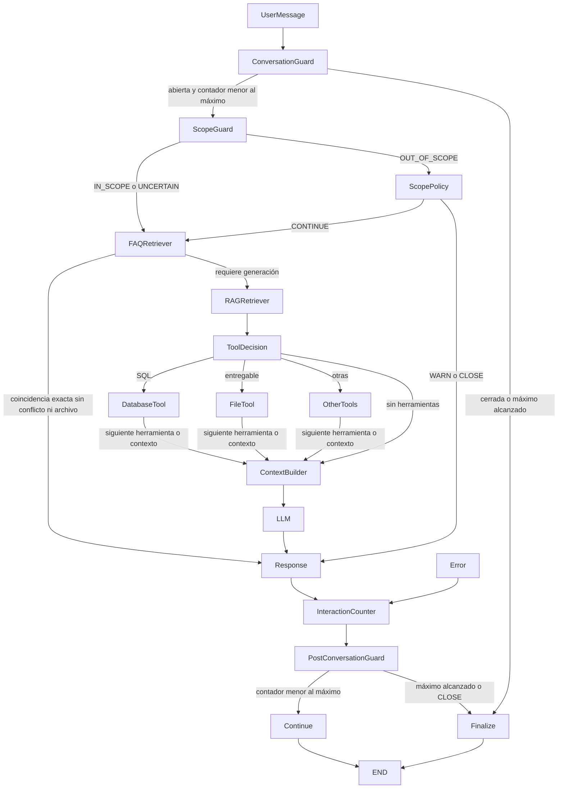

# Runtime, estado y proveedores

`app.runtime.AgentRuntime` compila un `StateGraph` de LangGraph. Cada llamada
`await runtime.run(state)` procesa una pregunta y devuelve el nuevo estado. La
API guarda la memoria y el contador en PostgreSQL. `Continue` termina esa
invocación y deja la conversación `ACTIVE` para recibir el siguiente mensaje.
No hay una cadena lineal que reemplace las decisiones del grafo.

El diagrama conceptual abrevia el despacho entre herramientas: el grafo real
procesa secuencialmente las llamadas pendientes, con nodos distintos para SQL,
archivos y otras herramientas, antes de construir el contexto. El método
`runtime.mermaid()` exporta el diagrama **real**, incluidas todas las aristas de
error y despacho. Cada nodo agrega `{node, status, decision?}` a `trace`, visible
en los resultados de la API y persistible con la conversación.

| Campo | Uso |
| --- | --- |
| `conversation_id`, `agent_id`, `user_id`, `channel` | Identidad y canal; autorización en los servicios |
| `messages`, `question` | Historial persistido y mensaje actual |
| `interaction_count`, `max_interactions` | Una interacción por pregunta aceptada |
| `scope_status` | `IN_SCOPE`, `UNCERTAIN`, `OUT_OF_SCOPE` |
| `retrieved_faqs`, `retrieved_documents` | Evidencia con IDs y metadata de fuente |
| `tool_calls`, `pending_tools`, `tool_results` | Decisiones y ejecución acotada |
| `attachments` | Archivos entregables autorizados por el servicio |
| `context`, `response`, `tokens`, `answered` | Contexto limitado y salida del modelo |
| `conversation_status` | `ACTIVE`, `CLOSED`, `ERROR` |
| `trace`, `error` | Transiciones observadas y error público saneado |

`CLOSE` devuelve el mensaje de fuera de alcance, cuenta la pregunta y cierra.
`WARN` devuelve la advertencia, cuenta y conserva abierta la conversación.
`CONTINUE` conserva `OUT_OF_SCOPE` para analítica y procesa la pregunta. Una
clasificación desconocida se convierte en `UNCERTAIN`. La última pregunta
permitida recibe respuesta; las posteriores reciben el mensaje de cierre sin
ejecutar recuperación ni modelos ni aumentar el contador.

Los errores de hooks pasan por `Error`, producen un mensaje neutro, cuentan una
sola interacción y dejan `ERROR` recuperable en el siguiente turno, salvo que ya
se haya alcanzado el máximo. Nunca se guarda `str(exception)`, que puede contener
credenciales de un SDK. Se limitan las herramientas a ocho por turno y el
contexto por defecto a 32.000 caracteres.

La evidencia se deduplica y limita conservando JSON válido. El historial tiene
otro presupuesto de 16.000 caracteres y excluye la pregunta actual, que se envía
una sola vez. Consulta la [revisión de prompts y RAG](analisis-modelo-prompts-rag.md)
para ver los controles, el uso por etapa y los límites de la medición de tokens.

## Puertos del runtime

`RuntimeHooks` contiene `classify_scope`, `retrieve_faqs`, `retrieve_documents`,
`decide_tools`, `execute_tool` y `generate`, todos asíncronos. Los servicios
implementan esos puertos usando repositorios, permisos y credenciales cifradas.
El runtime no conoce FastAPI, Streamlit, SQLAlchemy, Chroma ni llaves de API.

Una llamada de herramienta usa `type` (`database`, `file` o el nombre de otra
herramienta). Su resultado puede incluir `attachments: [{file_id, ...}]`; el
runtime acumula y deduplica esos adjuntos. Los servicios deben verificar que el
archivo pertenezca al agente. El runtime nunca transforma una ruta arbitraria
en un archivo entregable ni ejecuta SQL directamente.

## Pipeline y sustituciones

`LoaderPipeline.load` usa `FileDocumentLoader`, una implementación de
`langchain_core.document_loaders.BaseLoader` para PDF (`pypdf`), DOCX
(`python-docx`, incluidos párrafos y tablas), TXT y MD. Normaliza Unicode y saltos de línea,
omite documentos sin texto y mantiene las fuentes. PDFs escaneados requieren
un proveedor OCR adicional: no se inventa texto cuando el PDF carece de él.
`split` utiliza `RecursiveCharacterTextSplitter` y conserva fuente, página,
índice de chunk y posición inicial. Los loaders síncronos se ejecutan mediante
la interfaz asíncrona de LangChain y el resto del trabajo bloqueante se deriva
a un thread desde los proveedores.

`EmbeddingProvider.build(api_key, model)` devuelve `Embeddings` de LangChain.
Existen `OpenAIEmbeddingProvider` y `GeminiEmbeddingProvider`. `LLMProvider`
devuelve `BaseChatModel`; existen `OpenAILLMProvider` y `GeminiLLMProvider`.
`list_models` consulta el catálogo accesible por la credencial. Gemini filtra
por capacidad; OpenAI no publica capacidades en `/models`, por lo que la UI
debe permitir seleccionar un modelo adecuado para chat o embeddings. No hay
una lista fija de modelos disponibles ni un fallback que finja conexión.

`VectorStoreProvider` expone `upsert`, `delete`, `retrieve`, todos asíncronos.
`ChromaVectorStoreProvider` usa `langchain-chroma` y el retriever LangChain
configurable (`similarity` o `mmr`). Cada colección combina agente, clase de
conocimiento y hash del perfil de embeddings. El hash adicional del ID del
agente evita colisiones al normalizar nombres. `profile` debe representar
proveedor, modelo y cualquier dimensión/opción que cambie los vectores.
Cambiarlo crea otro espacio; el servicio debe reindexar antes de activar ese
perfil. Eliminar IDs no genera embeddings ni requiere una llamada al modelo.

`FAISSVectorStoreProvider` es opcional para uso local en un único proceso.
Persiste documentos, metadata y vectores numéricos como JSON mediante reemplazo
atómico. Al leer reconstruye `faiss.IndexFlatIP` con embeddings precalculados y
normalizados para similitud coseno. Un `BaseRetriever` LangChain implementa
recuperación asíncrona y MMR: **no usa pickle ni deserialización peligrosa**. Este
enfoque no está pensado para varios workers ni grandes índices de producción.

Se evita `langchain-community`, cuyo [retiro fue anunciado oficialmente en mayo
de 2026](https://github.com/langchain-ai/langchain-community/issues/674). Las
abstracciones activas `BaseLoader`, `BaseRetriever`, `Embeddings` y `Document`
permanecen en `langchain-core`, con integraciones dedicadas para Chroma y modelos.

## Referencias verificadas

- [LangGraph Graph API](https://docs.langchain.com/oss/python/langgraph/graph-api)
- [Integración Chroma y retrievers](https://docs.langchain.com/oss/python/integrations/vectorstores/chroma)
- [Embeddings Gemini](https://docs.langchain.com/oss/python/integrations/embeddings/google_generative_ai)
- [Retrievers LangChain](https://reference.langchain.com/python/langchain-core/retrievers/BaseRetriever)
- [Extracción PDF](https://pypdf.readthedocs.io/en/stable/user/extract-text.html)
- [Objetos DOCX](https://python-docx.readthedocs.io/en/latest/api/document.html)
- [Catálogo de modelos Gemini](https://ai.google.dev/api/models)
- [Catálogo de modelos OpenAI](https://platform.openai.com/docs/api-reference/models)
